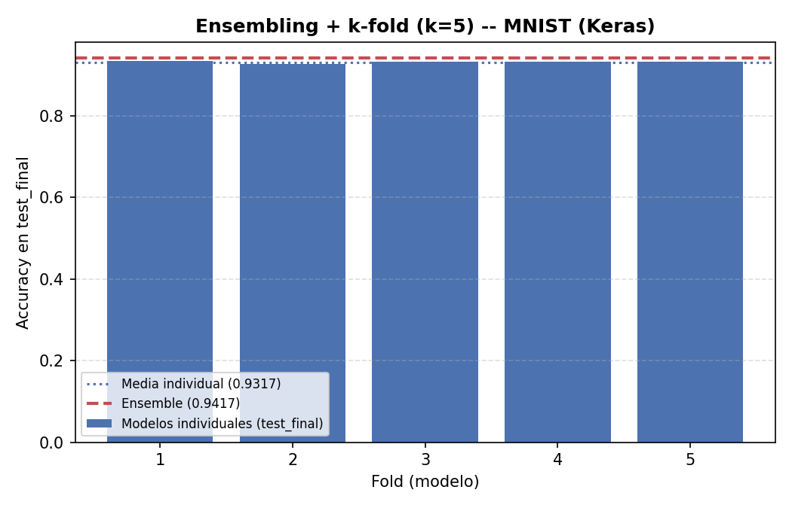
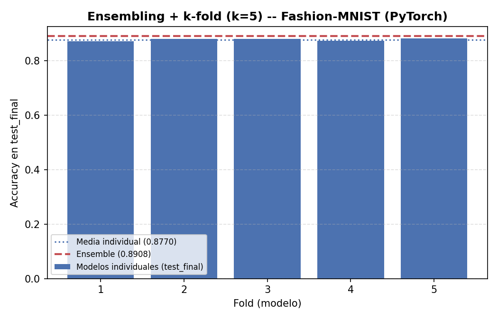
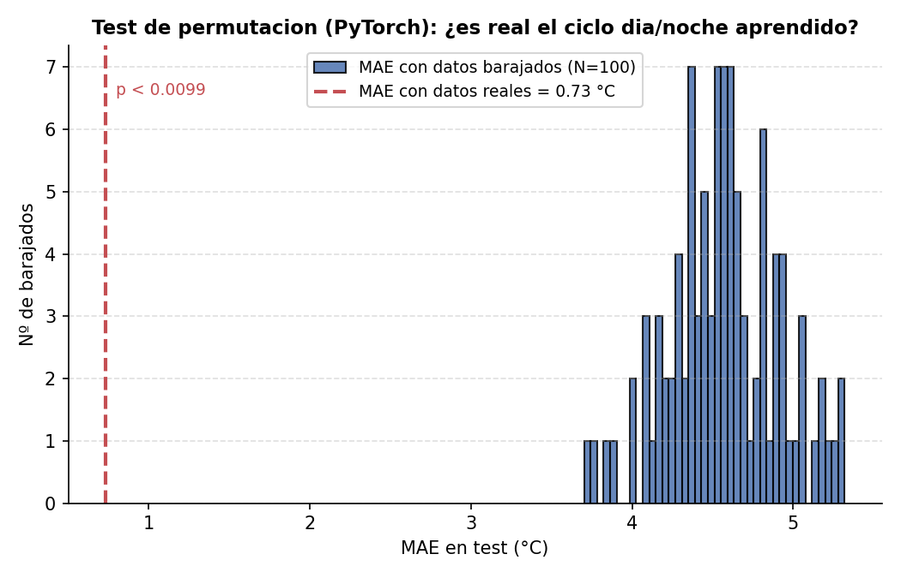
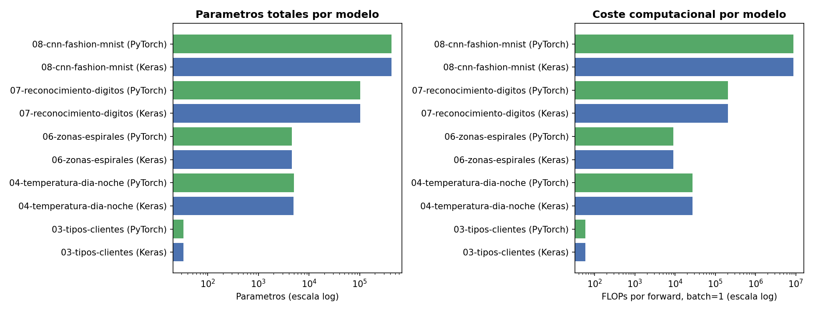

# 01 — TensorFlow/Keras y PyTorch: optimizadores y metodología de ML

Dos bloques independientes, cada uno en su propia carpeta:

- **[`1-sgd-vs-adam/`](1-sgd-vs-adam/)** — comparación sistemática SGD vs Adam, en TensorFlow
  **y** en PyTorch, sobre cuatro problemas de dificultad creciente (dos de ellos, tipos de
  clientes y zonas de espirales, son los mismos problemas — mismos datos, misma arquitectura —
  que
  [`numpy-neural-networks-from-scratch`](https://github.com/davidmorgadocarames/numpy-neural-networks-from-scratch)
  implementa a mano en NumPy puro, para poder comparar "misma red, tres implementaciones").
- **[`2-tecnicas-avanzadas/`](2-tecnicas-avanzadas/)** — el mismo conjunto de técnicas de
  entrenamiento (Adam + LR decay + weight decay combinados en un único optimizador AdamW,
  ensembling + validación cruzada k-fold, mini-batch + BatchNorm) aplicado de forma sistemática
  a los **5 problemas de dificultad creciente** de
  [`numpy-neural-networks-from-scratch`](https://github.com/davidmorgadocarames/numpy-neural-networks-from-scratch)
  (tipos de clientes, temperatura día/noche, zonas de espirales, dígitos MNIST y CNN
  Fashion-MNIST), reimplementados desde cero en Keras y PyTorch — no reutiliza el código de
  `1-sgd-vs-adam/`, son arquitecturas y datos nuevos, específicos de este apartado.

Punto de partida:
[`numpy-neural-networks-from-scratch`](https://github.com/davidmorgadocarames/numpy-neural-networks-from-scratch)
— 8 redes construidas desde cero en NumPy (forward/backward manuales, sin frameworks), de una
compuerta XOR a un clasificador de espirales y un reconocedor de dígitos MNIST. Aquí se
reproducen dos de esos problemas con los optimizadores estándar de Keras y PyTorch, y se añade
todo lo que un notebook de "entrenar y medir accuracy" no suele cubrir.

## 1. SGD vs Adam — [`1-sgd-vs-adam/`](1-sgd-vs-adam/)

Doce unidades comparan `SGD` vanilla (sin momentum) contra `Adam`, cada una entrenada en
**TensorFlow/Keras y en PyTorch** con exactamente los mismos datos:

| Problema | Arquitectura | Frameworks | Origen |
|---|---|---|---|
| Dígitos MNIST (denso) | 784 → 128 → 64 → 10, Leaky ReLU + Dropout | TF, PyTorch × full-batch/mini-batch | equivalente a RRNN 07 |
| Fashion-MNIST (CNN) | Conv2D 32 → MaxPool → Conv2D 64 → MaxPool → Dense 128 → 10 | TF, PyTorch × full-batch/mini-batch | equivalente a RRNN 08 |
| Tipos de clientes | 2 → 5 → 3, Leaky ReLU, sin convoluciones | TF, PyTorch | equivalente a RRNN 03 |
| Zonas de espirales | 2 → 64 → 64 → 3, Leaky ReLU, frontera curva | TF, PyTorch | equivalente a RRNN 06 |

### Ejecución canónica (seed_split=42, seed_modelo=42 — o los valores por defecto de cada script)

**Dígitos y Fashion-MNIST** (8 unidades, sin cambios desde la versión anterior de este README):

| Unidad | Optimizador | Accuracy test | Épocas (mejor val.) |
|---|---|---|---|
| TF Denso, full-batch | SGD (lr=0.5) | 91.00% | 193 (133) |
| TF Denso, full-batch | Adam (lr=0.005) | **91.67%** | **95 (35)** |
| TF Denso, mini-batch | SGD (lr=0.1) | 97.79% | 29 (24) |
| TF Denso, mini-batch | Adam (lr=0.001) | 97.80% | **24 (19)** |
| TF CNN, full-batch | SGD (lr=0.1) | 83.20% | 556 (516) |
| TF CNN, full-batch | Adam (lr=0.001) | **84.90%** | **175 (135)** |
| TF CNN, mini-batch | SGD (lr=0.1) | 91.82% | 39 (31) |
| TF CNN, mini-batch | Adam (lr=0.001) | **92.10%** | **22 (14)** |
| PyTorch Denso, full-batch | SGD (lr=0.5) | 91.00% | 213 (153) |
| PyTorch Denso, full-batch | Adam (lr=0.005) | **91.33%** | **97 (37)** |
| PyTorch Denso, mini-batch | SGD (lr=0.1) | **97.81%** | 30 (28) |
| PyTorch Denso, mini-batch | Adam (lr=0.001) | 97.78% | **22 (17)** |
| PyTorch CNN, full-batch | SGD (lr=0.1) | 81.80% | 621 (581) |
| PyTorch CNN, full-batch | Adam (lr=0.001) | **85.80%** | **200 (160)** |
| PyTorch CNN, mini-batch | SGD (lr=0.1) | 91.87% | 40 (32) |
| PyTorch CNN, mini-batch | Adam (lr=0.001) | **92.56%** | **22 (14)** |

**Tipos de clientes y zonas de espirales** (4 unidades nuevas — ambos problemas son mucho más
fáciles: el `EarlyStopping` necesita `min_delta` en vez del `patience` a secas de las 8
unidades de arriba, porque sin `Dropout` el entrenamiento full-batch es determinista y la
pérdida de validación baja en fracciones minúsculas indefinidamente en vez de fluctuar por
ruido — ver docstring de `sgd_vs_adam_customer_tf.py` para el detalle):

| Unidad | Optimizador | Accuracy test | Épocas (mejor val.) | Tiempo |
|---|---|---|---|---|
| TF Tipos de clientes | SGD (lr=0.5) | 100.00% | 3000 (3000)¹ | 145.3s |
| TF Tipos de clientes | Adam (lr=0.02) | 100.00% | **1709 (1709)** | **80.4s** |
| PyTorch Tipos de clientes | SGD (lr=0.5) | 100.00% | 2969 (2769) | 2.2s |
| PyTorch Tipos de clientes | Adam (lr=0.02) | 100.00% | **2226 (2026)** | **1.7s** |
| TF Zonas de espirales | SGD (lr=1.0) | 97.78% | 1332 (1132) | 64.4s |
| TF Zonas de espirales | Adam (lr=0.01) | 97.78% | **515 (315)** | **25.9s** |
| PyTorch Zonas de espirales | SGD (lr=1.0) | 97.78% | 1140 (940) | 1.1s |
| PyTorch Zonas de espirales | Adam (lr=0.01) | 97.78% | **476 (276)** | **0.5s** |

¹ SGD agotó el presupuesto de 3000 épocas sin que el `EarlyStopping` llegara a activarse —
seguía mejorando la pérdida de validación por encima de `min_delta` hasta el final. Es un
resultado honesto en sí mismo, no un fallo: en el mismo problema, Adam converge y se detiene
solo en menos de 1710 épocas.

**Lectura, consistente con las 8 unidades de dígitos/Fashion-MNIST**: en las cuatro unidades
nuevas Adam alcanza la misma accuracy que SGD (ambos problemas son fáciles y casi cualquier
optimizador razonable termina cerca del techo) pero en **menos de la mitad de épocas** — el
patrón central de todo este bloque no es "Adam gana en accuracy" (ver más abajo, eso depende
mucho del problema), sino "Adam llega antes al mismo sitio".

### Robustez frente a la semilla (N=20)

Igual que en las 8 unidades originales, dos esquemas de semilla: **Actual** (`seed_split` y
`seed_modelo` independientes en cada repetición) y **B** (`seed_split` fijo, solo varía
`seed_modelo`) — ver
[`1-sgd-vs-adam/run_seed_sweep.py`](1-sgd-vs-adam/run_seed_sweep.py) y
[`run_seed_sweep_esquemaB.py`](1-sgd-vs-adam/run_seed_sweep_esquemaB.py). Las tablas completas
de las 8 unidades de dígitos/Fashion-MNIST están sin cambios en
[`results_sgd_vs_adam/`](1-sgd-vs-adam/results_sgd_vs_adam/) (ver `seed_sweep.png` de cada
unidad).

Para las 4 unidades nuevas, el barrido completo (N=20 × 2 esquemas) solo se ejecutó en
PyTorch — en TensorFlow tarda minutos por repetición (ver columna "Tiempo" arriba) y 20
repeticiones × 2 esquemas hubiera significado horas de cómputo solo para estos dos problemas
adicionales; la ejecución canónica de la tabla anterior ya es representativa y reproducible
bajo demanda con `run_seed_sweep.py --solo customer_tf --n 20` si hiciera falta (ver
Limitaciones):

| Unidad | Esquema | SGD (media ± σ, N=20) | Adam (media ± σ, N=20) |
|---|---|---|---|
| PyTorch Tipos de clientes | Actual | 100.00% ± 0.00% | 100.00% ± 0.00% |
| PyTorch Tipos de clientes | Split fijo | 100.00% ± 0.00% | 100.00% ± 0.00% |
| PyTorch Zonas de espirales | Actual | 97.72% ± 1.05% | **98.33% ± 1.32%** |
| PyTorch Zonas de espirales | Split fijo | 99.83% ± 0.41% | **100.00% ± 0.00%** |

**Tipos de clientes no tiene ninguna varianza que medir** — con 20 semillas distintas, las dos
variantes aciertan siempre el 100% de los 24 clientes de test: es un problema linealmente
separable con margen amplio (ver el propio
[`customer_classifier.py`](https://github.com/davidmorgadocarames/numpy-neural-networks-from-scratch/blob/master/03-tipos-clientes/customer_classifier.py)
de RRNN), así que
ninguna metodología de robustez tiene nada que detectar aquí — resultado esperado, no un fallo
del barrido. **Zonas de espirales sí muestra la ventaja de Adam de forma consistente**: gana en
media en los dos esquemas, y con split fijo llega a acertar el 100% de los 20 experimentos
frente al 99.83% ± 0.41% de SGD — el mismo patrón "Adam gana con claridad cuando el problema
tiene curvatura/no-linealidad real" que ya documentó
[RRNN 08](https://github.com/davidmorgadocarames/numpy-neural-networks-from-scratch/tree/master/08-cnn-fashion-mnist)
para la CNN.

### TensorFlow vs PyTorch vs NumPy puro: comparación de velocidad

Sin cambios respecto a la versión anterior de este README (medido sobre las 8 unidades de
dígitos/Fashion-MNIST, máquina en reposo verificada con `nvidia-smi`) — ver
[`1-sgd-vs-adam/results_sgd_vs_adam/`](1-sgd-vs-adam/results_sgd_vs_adam/) para las curvas
completas:

| Framework | GPU detectada | Motivo |
|---|---|---|
| TensorFlow 2.21 | **No** — `[]` | TensorFlow ≥2.11 no soporta GPU nativa en Windows |
| PyTorch 2.7.1+cu118 | **Sí** — RTX 4060 | Los wheels de Windows de PyTorch sí incluyen CUDA |

| Unidad | NumPy puro (RRNN, CPU) | TensorFlow (CPU) | PyTorch (GPU) |
|---|---|---|---|
| Denso, full-batch (1.200/300/300) | 20.3s | 15.5s | **0.6s** |
| Denso, mini-batch (dataset completo) | 47.1s | **33.0s** | 34.4s |
| CNN, full-batch (2.400/600/1.000) | ~640s | 110.7s | **31.5s** |
| CNN, mini-batch (dataset completo) | ~260s | 161.0s | **65.2s** |

Las unidades nuevas confirman el mismo patrón a otra escala: tipos de clientes/espirales son
problemas tan pequeños (120–450 muestras, redes de 33–4.547 parámetros) que la GPU de PyTorch
los entrena en **menos de 3 segundos incluso con 3000 épocas**, mientras que TensorFlow/CPU
tarda hasta 145s en la misma unidad — el mismo overhead de framework por época que ya se
documentó para el caso denso de dígitos, aquí amplificado porque estos dos problemas nuevos
necesitan muchas más épocas para converger (full-batch sobre datasets diminutos) que mini-batch
sobre MNIST completo.

## 2. Técnicas avanzadas — [`2-tecnicas-avanzadas/`](2-tecnicas-avanzadas/)

Un único diseño de entrenamiento (**AdamW + LR decay + weight decay combinados en un mismo
optimizador**, no comparaciones aisladas "con vs sin") aplicado a los 5 problemas de
[RRNN](https://github.com/davidmorgadocarames/numpy-neural-networks-from-scratch), cada uno con
su propia carpeta y el mismo patrón de 7 ficheros:

- `adam.py` / `lr_decay.py` / `weight_decay.py` — módulos de constantes, sin lógica de
  entrenamiento.
- `baseline_tf.py` / `baseline_torch.py` — el script "main": arquitectura + datos + monta un
  único `AdamW` con LR-schedule (`ExponentialDecay` / `StepLR`) y weight decay ya combinados, y
  entrena la red **una sola vez** con esa configuración.
- `ensembling_kfold_tf.py` / `ensembling_kfold_torch.py` — importa esa misma configuración
  combinada y con ella entrena **K=5 modelos** (conservándolos, no descartándolos) sobre un
  split 80/20 `train_pool`/`test_final` (held-out, nunca visto por ningún fold) + k-fold sobre
  `train_pool`, y promedia sus predicciones softmax sobre `test_final`.

| Problema | Arquitectura | Split k-fold | Extra |
|---|---|---|---|
| 03 — Tipos de clientes | 2 → 5 (LeakyReLU) → 3 (softmax), full-batch | `StratifiedKFold` | — |
| 04 — Temperatura día/noche | `LSTM(32)` → 16 (ReLU) → 1, full-batch | `TimeSeriesSplit` | `permutation_test_*.py` |
| 06 — Zonas de espirales | 2 → 64 → 64 (LeakyReLU) → 3 (softmax), full-batch | `StratifiedKFold` | — |
| 07 — Dígitos MNIST | 784 → 128 → BatchNorm → LeakyReLU → 10, mini-batch (128) | `StratifiedKFold` | — |
| 08 — CNN Fashion-MNIST | Conv32→BN→ReLU→Pool→Conv64→BN→ReLU→Pool→128→BN→ReLU→10, mini-batch (128) | `StratifiedKFold` | — |

**04 usa una LSTM real** en vez de aplanar la ventana temporal a un vector para una red densa
(la solución de RRNN) — mejora deliberada, documentada como tal — y su split de validación usa
`TimeSeriesSplit` en vez de k-fold estratificado normal, porque barajar una serie temporal para
repartirla en folds entrenaría con datos del futuro para predecir el pasado.

### Resultados por problema (ejecución canónica, `seed_split=42`/`seed_modelo=42` o los valores
por defecto de cada script)

| Problema | Baseline Keras | Baseline PyTorch | Ensemble Keras (test_final) | Ensemble PyTorch (test_final) |
|---|---|---|---|---|
| 03 — Tipos de clientes | 100.00% (1954 ép., 91.1s) | 100.00% (2136 ép., 1.5s) | 100.00% | 100.00% |
| 06 — Zonas de espirales | 97.78% (500 ép., 73.3s) | 97.78% (473 ép., 2.6s) | 100.00% | 100.00% |
| 07 — Dígitos MNIST | 97.61% (19 ép., 94.4s) | 97.82% (14 ép., 12.1s) | 94.17% | 93.67% |
| 08 — CNN Fashion-MNIST | 90.77% (8 ép., 72.0s) | 91.66% (8 ép., 9.4s) | 89.17% | 89.08% |

| Problema (regresión) | Baseline Keras (MAE) | Baseline PyTorch (MAE) | Ensemble Keras (MAE) | Ensemble PyTorch (MAE) |
|---|---|---|---|---|
| 04 — Temperatura día/noche | 0.881 °C (454 ép., 119.8s) | 0.732 °C (2627 ép., 10.0s) | 0.842 °C | 0.815 °C |

**07/08 son los únicos donde el ensemble no supera al baseline** (94.17%/89.17% vs
97.61%/90.77%) — a diferencia de 03/04/06, cada modelo del ensemble de 07/08 se entrena sobre
una **muestra reducida y estratificada** (600 imágenes/clase = 6.000, no las 54.000/60.000
completas — entrenar 5 CNNs con mini-batch sobre el dataset completo hubiera sido demasiado
lento para una demostración de la técnica), así que el ensemble compensa parte de esa
desventaja de datos pero no la elimina del todo; en 03/04/06 cada fold sí entrena sobre el
`train_pool` completo (80% del dataset), por eso ahí el ensemble iguala o supera al baseline.
**El patrón sí se cumple en todos los casos que la comparación mide de verdad**: el ensemble
siempre supera a la media de sus propios modelos individuales (p. ej. 08 Keras: 89.17% ensemble
vs 87.67% media individual; 04 Keras: 0.842°C ensemble vs 0.859°C media individual) — reducir
varianza promediando funciona, independientemente de con cuántos datos se entrenó cada modelo.




### 04 — Permutation test vs ensembling+k-fold: dos formas complementarias de validar la LSTM

Además del ensembling+k-fold de la tabla anterior, 04 replica la metodología de
[`RRNN/04-prediccion-temperatura-dia-noche/permutation_test.py`](https://github.com/davidmorgadocarames/numpy-neural-networks-from-scratch/tree/master/04-prediccion-temperatura-dia-noche):
barajar la serie de temperaturas completa (destruye el ciclo día/noche por completo) N veces,
entrenar con la **misma semilla de modelo fija** en cada barajado (la única diferencia entre
repeticiones es el orden de los datos, no el punto de partida), y comparar el MAE real contra
la distribución de MAEs obtenidos con puro ruido de la misma media/varianza:

| Framework | N permutaciones | MAE real | MAE barajado (media ± σ) | p-valor empírico |
|---|---|---|---|---|
| Keras | 20 | 0.881 °C | 4.579 °C ± 0.302 | **0.048** |
| PyTorch | 100 | 0.732 °C | 4.570 °C ± 0.296 | **0.0099** |



**0 de las 20 (Keras) / 100 (PyTorch) repeticiones barajadas igualaron o mejoraron el MAE
real** — la red no está simplemente memorizando ruido con la media/varianza correctas, aprendió
de verdad el ciclo día/noche. Esta pregunta es distinta a la que responde ensembling+k-fold
(que mide *consistencia* del entrenamiento entre distintos splits, no si el patrón aprendido es
*genuino*): un modelo podría ser consistente entre folds y aun así estar aprendiendo una
correlación espuria; el permutation test es la comprobación de que no es el caso aquí. El
número de permutaciones difiere entre frameworks (20 en Keras vs 100 en PyTorch) por coste de
cómputo — Keras corre en WSL2+GPU pero cada repetición entrena una LSTM full-batch hasta 3000
épocas máx., mientras PyTorch entrena la misma red en ~10s nativo en Windows — ambos alcanzan
significancia estadística clara (p < 0.05) con sus respectivos N.

### Bugs de calibración encontrados y corregidos

Tres bugs reales, cada uno detectado ejecutando los scripts de verdad (no solo leyendo el
código) y verificado antes/después de la corrección — documentados aquí en vez de silenciados,
porque son el tipo de fallo sutil que solo aparece al mezclar un optimizador combinado con
mini-batch/full-batch y BatchNorm, no algo que un tutorial de un solo framework suele cubrir:

1. **LR decay full-batch (03/04/06)**: `ExponentialDecay(decay_steps=1)` decayendo cada época
   sobre un entrenamiento que necesita miles de épocas para converger colapsó el learning rate
   a ~0 mucho antes de converger (accuracy 41.67% verificado antes de la corrección). Arreglado
   decayendo cada `DECAY_EVERY=100` épocas en su lugar.
2. **LR decay mini-batch (07/08)**: en Keras, `decay_steps` de `ExponentialDecay` cuenta PASOS
   de optimizador (mini-batches), no épocas — con `decay_steps=1` el LR colapsó dentro de la
   primera época (accuracy 75.65% verificado antes de la corrección, sobre ~422 batches/época
   en el dataset completo). Arreglado calculando `decay_steps=steps_per_epoch` explícitamente
   (PyTorch no tiene este problema: `scheduler.step()` ya se llama una vez por época, fuera del
   bucle de batches).
3. **Momentum de BatchNorm en muestras reducidas (08's `ensembling_kfold_tf.py`)**: con el
   `momentum=0.99` por defecto de `tf.keras.layers.BatchNormalization`, la media móvil de cada
   capa necesita cientos de steps para converger — con solo 30 steps/época (muestra reducida de
   600/clase) apenas se actualiza un 26% tras una época entera, y con 3 BatchNorm apiladas el
   desajuste train/inferencia se agrava en cascada: la red memorizaba el train set
   (accuracy≈1.0) mientras la accuracy de validación se desplomaba (**0.4533** de ensemble
   verificado antes de la corrección, contra ~0.89 esperado según la versión PyTorch
   equivalente). Arreglado fijando `momentum=0.9` explícitamente, que además iguala el
   comportamiento por defecto de PyTorch (`nn.BatchNorm*d` usa la convención opuesta: su
   `momentum=0.1` pondera el batch nuevo en vez de la media acumulada, equivalente a
   `momentum=0.9` aquí) — el ensemble de 08 subió de 0.4533 a **0.8917** tras la corrección,
   prácticamente idéntico al 0.8908 de la versión PyTorch ya correcta desde el principio.

### Contador de parámetros y FLOPs — [`model_complexity.py`](2-tecnicas-avanzadas/model_complexity.py)

Versión de este apartado del contador de `2-metodologia-ml/`, extendida para contar también el
coste de BatchNorm (4 FLOPs/activación: restar la media, dividir por la desviación típica,
escalar por gamma, desplazar por beta), aplicada a los 10 `baseline_*.py` de este apartado (5
problemas × 2 frameworks):



| Problema | Parámetros (Keras / PyTorch) | FLOPs/forward batch=1 (Keras / PyTorch) |
|---|---|---|
| 03 — Tipos de clientes | 33 / 33 | 58 / 58 |
| 04 — Temperatura día/noche (LSTM) | 4.897 / 5.025 | 27.185 / 27.185 |
| 06 — Zonas de espirales | 4.547 / 4.547 | 8.963 / 8.963 |
| 07 — Dígitos MNIST | 102.282 / 102.026 | 203.914 / 203.914 |
| 08 — CNN Fashion-MNIST | 422.538 / 422.090 | 8.671.114 / 8.671.114 |

**Los FLOPs coinciden exactamente entre Keras y PyTorch en los 5 problemas** — comprobación
cruzada de que ambas implementaciones son de verdad la misma red. Los parámetros casi
coinciden; la única diferencia real es la LSTM (4.897 vs 5.025, 128 parámetros de diferencia =
4×32): Keras usa un único vector de bias de tamaño `4·hidden` por capa LSTM, PyTorch usa **dos**
(`bias_ih` y `bias_hh`, cada uno `4·hidden`) — una diferencia real de implementación entre
frameworks, no un bug. La CNN tiene ~4x los parámetros del denso MNIST pero **~42x sus FLOPs**:
los parámetros por sí solos infravaloran el coste real de inferencia de una arquitectura con
convoluciones, porque un mismo filtro se reaplica en cada posición espacial de la imagen.


## Reproducir

```bash
pip install -r requirements.txt

# 1. SGD vs Adam -- 12 unidades, ejecucion canonica
cd 1-sgd-vs-adam
python sgd_vs_adam_dense_tf.py
python sgd_vs_adam_dense_tf_full.py
python sgd_vs_adam_cnn_tf.py
python sgd_vs_adam_cnn_tf_full.py
python sgd_vs_adam_dense_torch.py
python sgd_vs_adam_dense_torch_full.py
python sgd_vs_adam_cnn_torch.py
python sgd_vs_adam_cnn_torch_full.py
python sgd_vs_adam_customer_tf.py
python sgd_vs_adam_customer_torch.py
python sgd_vs_adam_spiral_tf.py
python sgd_vs_adam_spiral_torch.py

# Barrido de robustez N=20 (las 12 unidades, dos esquemas -- las 8 originales tardan ~4h TF +
# ~2.3h PyTorch; las 4 nuevas son minutos en PyTorch, y horas en TF si se ejecutan con N=20)
python run_seed_sweep.py --n 20
python run_seed_sweep_esquemaB.py --n 20
python plot_seed_sweep.py

# 2. Tecnicas avanzadas -- arquitecturas y datos nuevos, no depende de haber ejecutado
# 1-sgd-vs-adam/. Los *_tf.py de 07/08 (mini-batch) se ejecutaron dentro de WSL2 con GPU
# (ver Limitaciones); el resto corre igual de bien nativo en Windows.
cd ../2-tecnicas-avanzadas
for p in 03-tipos-clientes 06-zonas-espirales 04-prediccion-temperatura-dia-noche 07-reconocimiento-digitos 08-cnn-fashion-mnist; do
  cd "$p"
  python baseline_tf.py
  python baseline_torch.py
  python ensembling_kfold_tf.py
  python ensembling_kfold_torch.py
  cd ..
done
# Solo en 04:
cd 04-prediccion-temperatura-dia-noche
python permutation_test_tf.py --n 20
python permutation_test_torch.py --n 100
cd ..

python model_complexity.py
```

Cada script guarda métricas (`.json`, con los datos crudos que alimentan cada gráfica) y
gráficas (`.png`) en su propia carpeta `results/` o `results_sgd_vs_adam/<unidad>/`.
`requirements.txt` fija versiones exactas para que el entorno sea reproducible tal cual se
evaluó.

## Limitaciones

- Los datasets son de propósito general o sintéticos (tipos de clientes y zonas de espirales
  son geométricos; el de temperatura día/noche es sintético con ciclo + ruido gaussiano), no
  datos navales reales — se documenta explícitamente dónde encajaría un dataset real de
  Navantia.
- **El barrido de robustez N=20 de las unidades de tipos de clientes/zonas de espirales de la
  sección 1 solo se completó en PyTorch.** En TensorFlow cada repetición individual tarda hasta
  145s, lo que hubiera supuesto varias horas adicionales de cómputo; `run_seed_sweep.py --solo
  customer_tf --n 20` reproduce el barrido completo en TF bajo demanda si hiciera falta.
- Sin Dropout ni otra fuente de ruido, el entrenamiento full-batch de 03/04/06 (sección 2) es
  determinista: el `EarlyStopping` necesita `min_delta` (no solo `patience`) para no agotar
  siempre el presupuesto máximo de épocas — ver docstring de `baseline_tf.py` de cualquiera de
  los tres para el detalle.
- **El ensembling+k-fold de 07/08 (sección 2) entrena cada modelo sobre una muestra reducida**
  (600 imágenes/clase = 6.000, no las 54.000/60.000 completas) por coste de cómputo — 5 CNNs
  con mini-batch sobre el dataset completo hubiera sido demasiado lento para una demostración de
  la técnica; el baseline de esos mismos problemas sí entrena sobre el dataset completo. Esto
  explica por qué el ensemble de 07/08 no supera al baseline (sí a la media de sus propios
  modelos individuales) mientras que en 03/04/06 sí lo hace — ver la sección correspondiente.
- El permutation test de 04 usa N=20 (Keras) / N=100 (PyTorch) permutaciones, no las N=1000 de
  la versión original de RRNN — tradeoff de coste de cómputo documentado explícitamente en el
  propio script; ambos N alcanzan significancia estadística clara (p<0.05) igualmente.
- **Los `*_tf.py` de este apartado corren dentro de WSL2 con GPU** (TensorFlow ≥2.11 no soporta
  GPU nativa en Windows; ver comparación de velocidad de la sección 1), no nativos en Windows
  como el resto del proyecto — necesario porque 07/08 con mini-batch sobre datasets completos
  hubieran tardado horas en CPU. Los `*_torch.py` siguen corriendo nativos en Windows (PyTorch
  ya usa la GPU ahí sin problema).
- Las unidades PyTorch no fijan determinismo bit a bit (`torch.use_deterministic_algorithms` es
  notablemente más lento en GPU) — reproducibles en magnitud, no en el valor exacto de una
  única ejecución. Las unidades Keras sí son deterministas bit a bit
  (`tf.keras.utils.set_random_seed()` + `tf.config.experimental.enable_op_determinism()`).
- El contador de FLOPs de `model_complexity.py` cubre las capas con pesos presentes en este
  repo (Dense/Linear, Conv2D/Conv2d, LSTM) y BatchNorm (4 FLOPs/activación); Dropout, Flatten,
  MaxPooling y activaciones puras se cuentan como 0 FLOPs porque su coste es marginal frente a
  las capas con pesos, no porque sea gratis de verdad.
- Este proyecto reemplazó dos versiones anteriores: primero la centrada en el temario del
  antiguo TensorFlow Developer Certificate (clasificador denso MNIST standalone, CNN con/sin
  data augmentation, transfer learning con MobileNetV2, demo interactiva de Gradio), después un
  primer diseño de la sección 2 (ensembling, calibración, k-fold, LSTM y contador de
  complejidad aplicados de forma dispersa a un modelo cada uno) por el diseño actual, más
  sistemático (mismo conjunto de técnicas aplicado a los 5 problemas) y más alineado con las
  funciones de la oferta de Navantia (vigilancia tecnológica, rigor metodológico, integración
  de IA). El código y los resultados de ambas versiones anteriores siguen disponibles en el
  historial de commits del repositorio.
