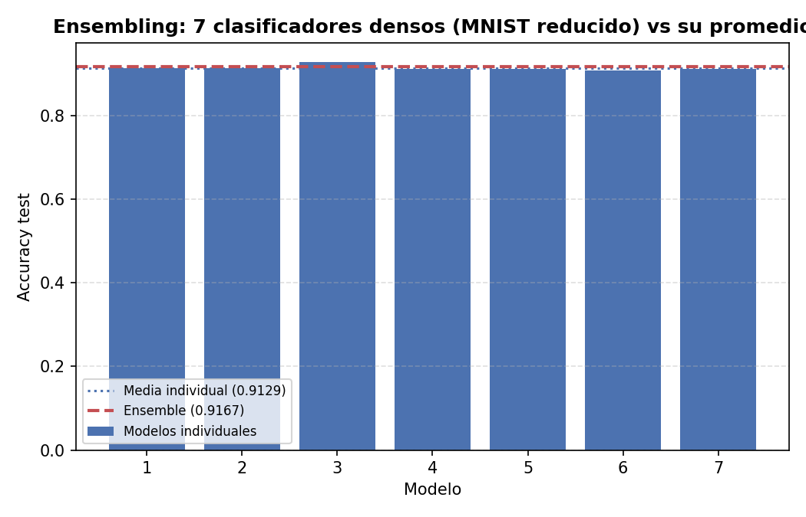
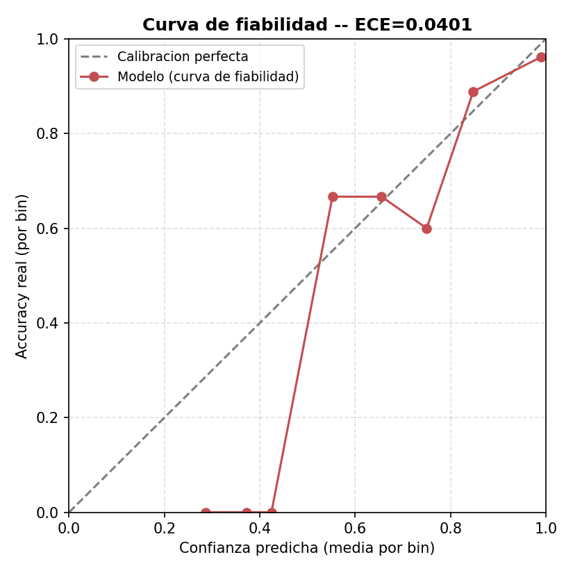
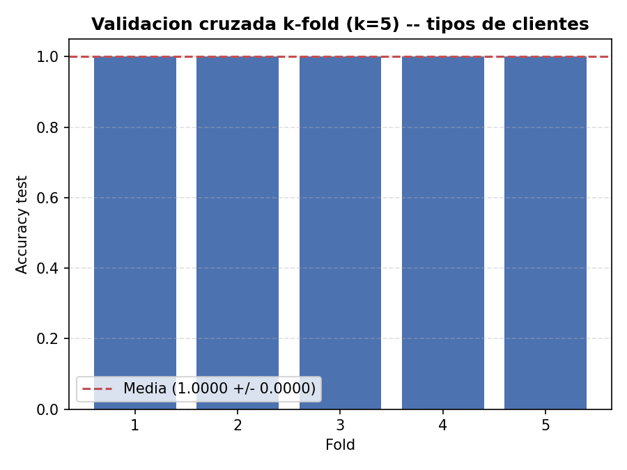
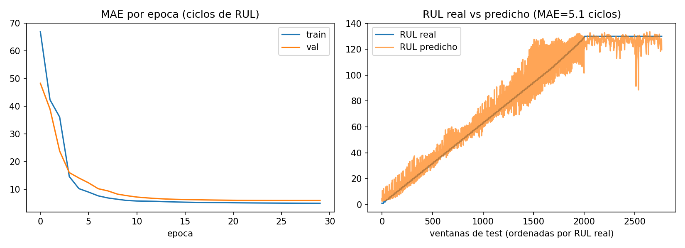
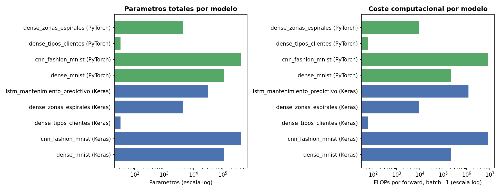

# 01 — TensorFlow/Keras y PyTorch: optimizadores y metodología de ML

Dos bloques independientes, cada uno en su propia carpeta:

- **[`1-sgd-vs-adam/`](1-sgd-vs-adam/)** — comparación sistemática SGD vs Adam, en TensorFlow
  **y** en PyTorch, sobre cuatro problemas de dificultad creciente (dos de ellos, tipos de
  clientes y zonas de espirales, son los mismos problemas — mismos datos, misma arquitectura —
  que
  [`numpy-neural-networks-from-scratch`](https://github.com/davidmorgadocarames/numpy-neural-networks-from-scratch)
  implementa a mano en NumPy puro, para poder comparar "misma red, tres implementaciones").
- **[`2-metodologia-ml/`](2-metodologia-ml/)** — cinco técnicas de metodología de ML
  (ensembling, calibración, validación cruzada k-fold, una LSTM de mantenimiento predictivo y
  un contador de parámetros/FLOPs) que van más allá de entrenar un modelo y medir accuracy:
  responden a "¿puedo fiarme de esta confianza?", "¿cuánto cuesta este modelo de verdad?",
  "¿esta ventaja es real o suerte de la semilla?".

Punto de partida:
[`numpy-neural-networks-from-scratch`](https://github.com/davidmorgadocarames/numpy-neural-networks-from-scratch)
— 8 redes construidas desde cero en NumPy (forward/backward manuales, sin frameworks), de una
compuerta XOR a un clasificador de espirales y un reconocedor de dígitos MNIST. Aquí se
reproducen dos de esos problemas con los optimizadores estándar de Keras y PyTorch, y se añade
todo lo que un notebook de "entrenar y medir accuracy" no suele cubrir.

## 1. SGD vs Adam — [`1-sgd-vs-adam/`](1-sgd-vs-adam/)

Doce unidades comparan `SGD` vanilla (sin momentum) contra `Adam`, cada una entrenada en
**TensorFlow/Keras y en PyTorch** con exactamente los mismos datos:

| Problema | Arquitectura | Frameworks | Origen |
|---|---|---|---|
| Dígitos MNIST (denso) | 784 → 128 → 64 → 10, Leaky ReLU + Dropout | TF, PyTorch × full-batch/mini-batch | equivalente a RRNN 07 |
| Fashion-MNIST (CNN) | Conv2D 32 → MaxPool → Conv2D 64 → MaxPool → Dense 128 → 10 | TF, PyTorch × full-batch/mini-batch | equivalente a RRNN 08 |
| Tipos de clientes | 2 → 5 → 3, Leaky ReLU, sin convoluciones | TF, PyTorch | equivalente a RRNN 03 |
| Zonas de espirales | 2 → 64 → 64 → 3, Leaky ReLU, frontera curva | TF, PyTorch | equivalente a RRNN 06 |

### Ejecución canónica (seed_split=42, seed_modelo=42 — o los valores por defecto de cada script)

**Dígitos y Fashion-MNIST** (8 unidades, sin cambios desde la versión anterior de este README):

| Unidad | Optimizador | Accuracy test | Épocas (mejor val.) |
|---|---|---|---|
| TF Denso, full-batch | SGD (lr=0.5) | 91.00% | 193 (133) |
| TF Denso, full-batch | Adam (lr=0.005) | **91.67%** | **95 (35)** |
| TF Denso, mini-batch | SGD (lr=0.1) | 97.79% | 29 (24) |
| TF Denso, mini-batch | Adam (lr=0.001) | 97.80% | **24 (19)** |
| TF CNN, full-batch | SGD (lr=0.1) | 83.20% | 556 (516) |
| TF CNN, full-batch | Adam (lr=0.001) | **84.90%** | **175 (135)** |
| TF CNN, mini-batch | SGD (lr=0.1) | 91.82% | 39 (31) |
| TF CNN, mini-batch | Adam (lr=0.001) | **92.10%** | **22 (14)** |
| PyTorch Denso, full-batch | SGD (lr=0.5) | 91.00% | 213 (153) |
| PyTorch Denso, full-batch | Adam (lr=0.005) | **91.33%** | **97 (37)** |
| PyTorch Denso, mini-batch | SGD (lr=0.1) | **97.81%** | 30 (28) |
| PyTorch Denso, mini-batch | Adam (lr=0.001) | 97.78% | **22 (17)** |
| PyTorch CNN, full-batch | SGD (lr=0.1) | 81.80% | 621 (581) |
| PyTorch CNN, full-batch | Adam (lr=0.001) | **85.80%** | **200 (160)** |
| PyTorch CNN, mini-batch | SGD (lr=0.1) | 91.87% | 40 (32) |
| PyTorch CNN, mini-batch | Adam (lr=0.001) | **92.56%** | **22 (14)** |

**Tipos de clientes y zonas de espirales** (4 unidades nuevas — ambos problemas son mucho más
fáciles: el `EarlyStopping` necesita `min_delta` en vez del `patience` a secas de las 8
unidades de arriba, porque sin `Dropout` el entrenamiento full-batch es determinista y la
pérdida de validación baja en fracciones minúsculas indefinidamente en vez de fluctuar por
ruido — ver docstring de `sgd_vs_adam_customer_tf.py` para el detalle):

| Unidad | Optimizador | Accuracy test | Épocas (mejor val.) | Tiempo |
|---|---|---|---|---|
| TF Tipos de clientes | SGD (lr=0.5) | 100.00% | 3000 (3000)¹ | 145.3s |
| TF Tipos de clientes | Adam (lr=0.02) | 100.00% | **1709 (1709)** | **80.4s** |
| PyTorch Tipos de clientes | SGD (lr=0.5) | 100.00% | 2969 (2769) | 2.2s |
| PyTorch Tipos de clientes | Adam (lr=0.02) | 100.00% | **2226 (2026)** | **1.7s** |
| TF Zonas de espirales | SGD (lr=1.0) | 97.78% | 1332 (1132) | 64.4s |
| TF Zonas de espirales | Adam (lr=0.01) | 97.78% | **515 (315)** | **25.9s** |
| PyTorch Zonas de espirales | SGD (lr=1.0) | 97.78% | 1140 (940) | 1.1s |
| PyTorch Zonas de espirales | Adam (lr=0.01) | 97.78% | **476 (276)** | **0.5s** |

¹ SGD agotó el presupuesto de 3000 épocas sin que el `EarlyStopping` llegara a activarse —
seguía mejorando la pérdida de validación por encima de `min_delta` hasta el final. Es un
resultado honesto en sí mismo, no un fallo: en el mismo problema, Adam converge y se detiene
solo en menos de 1710 épocas.

**Lectura, consistente con las 8 unidades de dígitos/Fashion-MNIST**: en las cuatro unidades
nuevas Adam alcanza la misma accuracy que SGD (ambos problemas son fáciles y casi cualquier
optimizador razonable termina cerca del techo) pero en **menos de la mitad de épocas** — el
patrón central de todo este bloque no es "Adam gana en accuracy" (ver más abajo, eso depende
mucho del problema), sino "Adam llega antes al mismo sitio".

### Robustez frente a la semilla (N=20)

Igual que en las 8 unidades originales, dos esquemas de semilla: **Actual** (`seed_split` y
`seed_modelo` independientes en cada repetición) y **B** (`seed_split` fijo, solo varía
`seed_modelo`) — ver
[`1-sgd-vs-adam/run_seed_sweep.py`](1-sgd-vs-adam/run_seed_sweep.py) y
[`run_seed_sweep_esquemaB.py`](1-sgd-vs-adam/run_seed_sweep_esquemaB.py). Las tablas completas
de las 8 unidades de dígitos/Fashion-MNIST están sin cambios en
[`results_sgd_vs_adam/`](1-sgd-vs-adam/results_sgd_vs_adam/) (ver `seed_sweep.png` de cada
unidad).

Para las 4 unidades nuevas, el barrido completo (N=20 × 2 esquemas) solo se ejecutó en
PyTorch — en TensorFlow tarda minutos por repetición (ver columna "Tiempo" arriba) y 20
repeticiones × 2 esquemas hubiera significado horas de cómputo solo para estos dos problemas
adicionales; la ejecución canónica de la tabla anterior ya es representativa y reproducible
bajo demanda con `run_seed_sweep.py --solo customer_tf --n 20` si hiciera falta (ver
Limitaciones):

| Unidad | Esquema | SGD (media ± σ, N=20) | Adam (media ± σ, N=20) |
|---|---|---|---|
| PyTorch Tipos de clientes | Actual | 100.00% ± 0.00% | 100.00% ± 0.00% |
| PyTorch Tipos de clientes | Split fijo | 100.00% ± 0.00% | 100.00% ± 0.00% |
| PyTorch Zonas de espirales | Actual | 97.72% ± 1.05% | **98.33% ± 1.32%** |
| PyTorch Zonas de espirales | Split fijo | 99.83% ± 0.41% | **100.00% ± 0.00%** |

**Tipos de clientes no tiene ninguna varianza que medir** — con 20 semillas distintas, las dos
variantes aciertan siempre el 100% de los 24 clientes de test: es un problema linealmente
separable con margen amplio (ver el propio
[`customer_classifier.py`](https://github.com/davidmorgadocarames/numpy-neural-networks-from-scratch/blob/master/03-tipos-clientes/customer_classifier.py)
de RRNN), así que
ninguna metodología de robustez tiene nada que detectar aquí — resultado esperado, no un fallo
del barrido. **Zonas de espirales sí muestra la ventaja de Adam de forma consistente**: gana en
media en los dos esquemas, y con split fijo llega a acertar el 100% de los 20 experimentos
frente al 99.83% ± 0.41% de SGD — el mismo patrón "Adam gana con claridad cuando el problema
tiene curvatura/no-linealidad real" que ya documentó
[RRNN 08](https://github.com/davidmorgadocarames/numpy-neural-networks-from-scratch/tree/master/08-cnn-fashion-mnist)
para la CNN.

### TensorFlow vs PyTorch vs NumPy puro: comparación de velocidad

Sin cambios respecto a la versión anterior de este README (medido sobre las 8 unidades de
dígitos/Fashion-MNIST, máquina en reposo verificada con `nvidia-smi`) — ver
[`1-sgd-vs-adam/results_sgd_vs_adam/`](1-sgd-vs-adam/results_sgd_vs_adam/) para las curvas
completas:

| Framework | GPU detectada | Motivo |
|---|---|---|
| TensorFlow 2.21 | **No** — `[]` | TensorFlow ≥2.11 no soporta GPU nativa en Windows |
| PyTorch 2.7.1+cu118 | **Sí** — RTX 4060 | Los wheels de Windows de PyTorch sí incluyen CUDA |

| Unidad | NumPy puro (RRNN, CPU) | TensorFlow (CPU) | PyTorch (GPU) |
|---|---|---|---|
| Denso, full-batch (1.200/300/300) | 20.3s | 15.5s | **0.6s** |
| Denso, mini-batch (dataset completo) | 47.1s | **33.0s** | 34.4s |
| CNN, full-batch (2.400/600/1.000) | ~640s | 110.7s | **31.5s** |
| CNN, mini-batch (dataset completo) | ~260s | 161.0s | **65.2s** |

Las unidades nuevas confirman el mismo patrón a otra escala: tipos de clientes/espirales son
problemas tan pequeños (120–450 muestras, redes de 33–4.547 parámetros) que la GPU de PyTorch
los entrena en **menos de 3 segundos incluso con 3000 épocas**, mientras que TensorFlow/CPU
tarda hasta 145s en la misma unidad — el mismo overhead de framework por época que ya se
documentó para el caso denso de dígitos, aquí amplificado porque estos dos problemas nuevos
necesitan muchas más épocas para converger (full-batch sobre datasets diminutos) que mini-batch
sobre MNIST completo.

## 2. Metodología de ML — [`2-metodologia-ml/`](2-metodologia-ml/)

Cinco técnicas que van más allá de "entrenar un modelo y medir accuracy", cada una en su propio
script, reutilizando arquitecturas y datos ya definidos en `1-sgd-vs-adam/` en vez de
reimplementarlos (`_common.py` importa `cargar_datos()`/`build_model()` directamente de esos
scripts). Todos guardan sus datos crudos en JSON junto a cada PNG (regla de reproducibilidad
del proyecto: sin eso, rehacer una gráfica exige reentrenar en vez de releer el JSON).

### 2.1 Ensembling — [`ensembling.py`](2-metodologia-ml/ensembling.py)

Entrena K=7 clasificadores densos MNIST (Adam, mismo split de datos, solo cambia
`seed_modelo`) y promedia sus probabilidades softmax en vez de quedarse con uno.



**Resultado**: accuracy individual 90.67%–92.67% (media 91.29%), **ensemble 91.67%** — el
ensemble supera a la media de los modelos individuales pero no al mejor modelo individual de
los 7 (92.67%). Es un resultado honesto y esperado: promediar reduce la varianza (ningún
ensemble caerá tan bajo como el peor modelo individual, 90.67% en esta ejecución) pero no
garantiza superar a la semilla más afortunada — la ventaja real de ensembling es no tener que
encontrar esa semilla de antemano.

### 2.2 Calibración — [`calibracion.py`](2-metodologia-ml/calibracion.py)

Curva de fiabilidad (confianza predicha vs accuracy real, 10 bins) sobre el mismo clasificador
denso MNIST.



**Resultado**: accuracy global 91.67%, confianza media predicha 94.47%, **ECE (Expected
Calibration Error) = 0.0401**. El modelo está ligeramente **sobreconfiado**: cuando dice que
está ~94% seguro en promedio, en realidad acierta el ~92% de las veces — un patrón típico de
redes entrenadas con entropía cruzada sin ninguna técnica de calibración explícita (temperature
scaling, label smoothing). Relevante en un contexto de producción: si se usara la confianza del
modelo para decidir qué predicciones escalar a revisión humana, este desajuste de ~4 puntos
haría que se aceptasen automáticamente más predicciones erróneas de las esperadas.

### 2.3 Validación cruzada k-fold — [`kfold_cross_validation.py`](2-metodologia-ml/kfold_cross_validation.py)

Alternativa metodológica al barrido de semillas Monte Carlo: en vez de repetir con splits
aleatorios independientes, parte el dataset completo de tipos de clientes (120 muestras) en 5
folds disjuntos que cubren el 100% de los datos exactamente una vez cada uno.



**Resultado**: 100.00% de accuracy en los 5 folds, sin ninguna varianza — coherente con el
barrido de semillas de la sección 1 (tipos de clientes es linealmente separable con margen
amplio, así que ninguna metodología de validación tiene varianza real que detectar aquí). El
valor de esta sección no está en el número en sí, sino en dejar implementada y verificada la
alternativa de k-fold para cuando se aplique a un problema con menos margen de separación.

### 2.4 LSTM de mantenimiento predictivo — [`lstm_mantenimiento_predictivo.py`](2-metodologia-ml/lstm_mantenimiento_predictivo.py)

Reaprovecha la idea del antiguo `03_lstm_predictive_maintenance.py` (eliminado de este proyecto
al reorganizarlo): predicción de vida útil restante (RUL) a partir de series temporales
sintéticas de 4 sensores por máquina, con estructura inspirada en el
[NASA C-MAPSS Turbofan Degradation dataset](https://data.nasa.gov/dataset/cmapss-jet-engine-simulated-data).



**Resultado**: MAE en test **5.06 ciclos**, RMSE **7.09 ciclos** (idéntico al resultado
original, entrenamiento determinista) — es la pieza que más conecta con "mantenimiento
predictivo" en un contexto naval/industrial. A diferencia de la versión original, el JSON de
resultados guarda también el historial completo de entrenamiento y los pares RUL real/predicho
de las 2.767 ventanas de test, no solo las métricas finales.

### 2.5 Contador de parámetros y FLOPs — [`model_complexity.py`](2-metodologia-ml/model_complexity.py)

Función reutilizable (`analizar_modelo_keras()` / `analizar_modelo_torch()`, esta última con
forward hooks porque PyTorch no expone la forma de salida de cada capa sin ejecutar un forward
real) que recorre un modelo ya entrenado y devuelve parámetros totales + FLOPs estimados por
forward — aplicada a los 9 modelos ya definidos en el repo.



| Modelo | Parámetros | FLOPs/forward (batch=1) |
|---|---|---|
| Denso MNIST (Keras / PyTorch) | 109.386 | 218.570 |
| CNN Fashion-MNIST (Keras / PyTorch) | 421.642 | 8.520.074 |
| Denso tipos de clientes (Keras / PyTorch) | 33 | 58 |
| Denso zonas de espirales (Keras / PyTorch) | 4.547 | 8.963 |
| LSTM mantenimiento predictivo (Keras) | 31.169 | 1.205.345 |

**Los parámetros coinciden exactamente entre Keras y PyTorch en las cuatro arquitecturas
compartidas** — una comprobación cruzada útil de que ambas implementaciones son de verdad la
misma red, no solo "arquitecturas parecidas". La CNN tiene ~4x los parámetros del denso MNIST
pero **~39x sus FLOPs**: los parámetros por sí solos (la métrica que más se mira) infravaloran
mucho el coste real de inferencia de una arquitectura con convoluciones, porque un mismo filtro
se reaplica en cada posición espacial de la imagen.

## Reproducir

```bash
pip install -r requirements.txt

# 1. SGD vs Adam -- 12 unidades, ejecucion canonica
cd 1-sgd-vs-adam
python sgd_vs_adam_dense_tf.py
python sgd_vs_adam_dense_tf_full.py
python sgd_vs_adam_cnn_tf.py
python sgd_vs_adam_cnn_tf_full.py
python sgd_vs_adam_dense_torch.py
python sgd_vs_adam_dense_torch_full.py
python sgd_vs_adam_cnn_torch.py
python sgd_vs_adam_cnn_torch_full.py
python sgd_vs_adam_customer_tf.py
python sgd_vs_adam_customer_torch.py
python sgd_vs_adam_spiral_tf.py
python sgd_vs_adam_spiral_torch.py

# Barrido de robustez N=20 (las 12 unidades, dos esquemas -- las 8 originales tardan ~4h TF +
# ~2.3h PyTorch; las 4 nuevas son minutos en PyTorch, y horas en TF si se ejecutan con N=20)
python run_seed_sweep.py --n 20
python run_seed_sweep_esquemaB.py --n 20
python plot_seed_sweep.py

# 2. Metodologia de ML -- reutiliza los modelos/datos de 1-sgd-vs-adam/, no depende de haber
# ejecutado los scripts de arriba (cada uno entrena lo que necesita)
cd ../2-metodologia-ml
python ensembling.py
python calibracion.py
python kfold_cross_validation.py
python lstm_mantenimiento_predictivo.py
python model_complexity.py
```

Cada script guarda métricas (`.json`, con los datos crudos que alimentan cada gráfica) y
gráficas (`.png`) en su propia carpeta `results/` o `results_sgd_vs_adam/<unidad>/`.
`requirements.txt` fija versiones exactas para que el entorno sea reproducible tal cual se
evaluó.

## Limitaciones

- Los datasets son de propósito general o sintéticos (tipos de clientes y zonas de espirales
  son geométricos; el de mantenimiento predictivo es sintético inspirado en C-MAPSS), no datos
  navales reales — se documenta explícitamente dónde encajaría un dataset real de Navantia.
- **El barrido de robustez N=20 de las 4 unidades nuevas (tipos de clientes, zonas de
  espirales) solo se completó en PyTorch.** En TensorFlow cada repetición individual tarda
  hasta 145s (tabla de la sección 1), lo que hubiera supuesto varias horas adicionales de
  cómputo solo para estos dos problemas; la tabla de robustez de esta versión del README se
  apoya en las 20 repeticiones de PyTorch más la ejecución canónica de TensorFlow (una única
  semilla). `run_seed_sweep.py --solo customer_tf --n 20` reproduce el barrido completo en TF
  bajo demanda si hiciera falta para una revisión más exhaustiva.
- Sin Dropout ni otra fuente de ruido, el entrenamiento full-batch de tipos de
  clientes/espirales es determinista: el `EarlyStopping` de estas 4 unidades necesita
  `min_delta` (no solo `patience`) para no agotar siempre el presupuesto máximo de épocas — ver
  docstring de `sgd_vs_adam_customer_tf.py` para el detalle y por qué las 8 unidades originales
  (con Dropout) no necesitan este ajuste.
- **Entrenado en CPU (TensorFlow), no GPU**, a pesar de que la máquina de desarrollo tiene una
  NVIDIA RTX 4060. TensorFlow ≥2.11 no soporta GPU de forma nativa en Windows (requiere WSL2 +
  `tensorflow[and-cuda]`, o el plugin DirectML, descontinuado desde TF 2.10) — PyTorch sí usa
  la GPU nativamente en Windows, de ahí la comparación de velocidad de la sección 1.
- Las unidades PyTorch no fijan determinismo bit a bit (`torch.use_deterministic_algorithms`
  es notablemente más lento en GPU) — cada semilla es reproducible en media/varianza sobre
  N=20 repeticiones, no en el valor exacto de una única ejecución. Las unidades Keras sí son
  deterministas bit a bit (`tf.keras.utils.set_random_seed()` +
  `tf.config.experimental.enable_op_determinism()`, verificado con ejecuciones repetidas).
- El contador de FLOPs de `model_complexity.py` cubre las capas con pesos presentes en este
  repo (Dense/Linear, Conv2D/Conv2d, LSTM); Dropout, Flatten, MaxPooling y activaciones se
  cuentan como 0 FLOPs porque su coste es marginal frente a las capas con pesos, no porque sea
  gratis de verdad.
- Este proyecto reemplazó una versión anterior centrada en el temario del antiguo TensorFlow
  Developer Certificate (clasificador denso MNIST standalone, CNN con/sin data augmentation,
  transfer learning con MobileNetV2, demo interactiva de Gradio) por este enfoque de
  optimizadores + metodología de ML, más alineado con las funciones de la oferta de Navantia
  (vigilancia tecnológica, rigor metodológico, integración de IA). El código y los resultados
  de esa versión anterior siguen disponibles en el historial de commits del repositorio.
